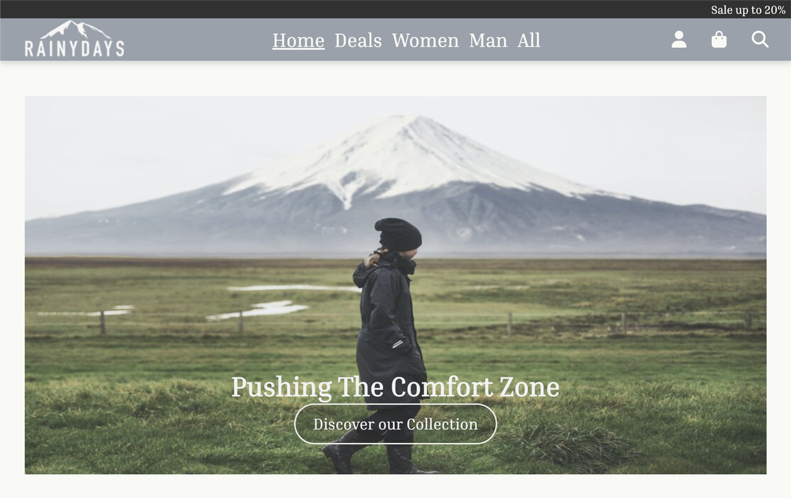

# RainyDays

My very first webpage, this is where it all started. Having just acquired some Design, CSS, HTML knowledge the Norwegian University Noroff mad its first task ready. Having a choice between 3 different ideas and predisposed images, I went with making a website for jackets. At first, this website did not contain any JS nor error or loading displays. Eventually this website turned into something more, having to implement more of the knowledge acquired along the academic path.



Explore the website by visiting the link - [RainyDays](https://rainjackets.netlify.app/)

## Key Features

- Home Page displays jackets and possible categories to choose from
- Deals/Women/Man Pages all show the jackets for the selected page
- List of Jackets Page shows all jackets displayed on all the pages
- Details Page allows to read a bit about the jacket and move on to buying it
- Payment and Checkout have been divided for clearer movement along the pages
- Contact Page features a picture of a map and allows the user to fill out the form

## Built With

- Visual Studio Code

## Getting Started

### Installing:

1. Clone the repo:

```bash
git clone https://github.com/Nikita-stud/Interaction-Design
```

2. Install the dependencies:

```bash
npm install
```

### Running

To run the app, run the following commands:

```bash
npm run start
```

## Future Improvements

- I ll leave the website as it is for the tribe it deserves

## Contact

You can always contact me though email or my phone number.

nikita151998@gmail.com
<br>
+4745588474
